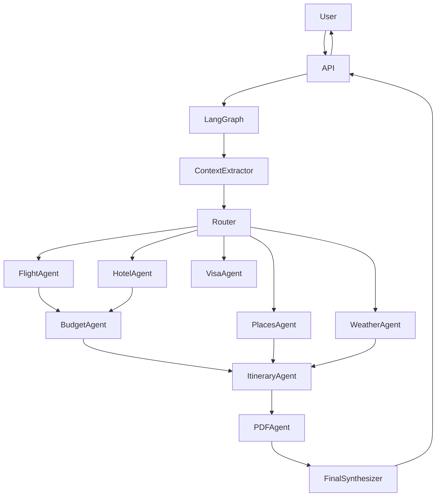
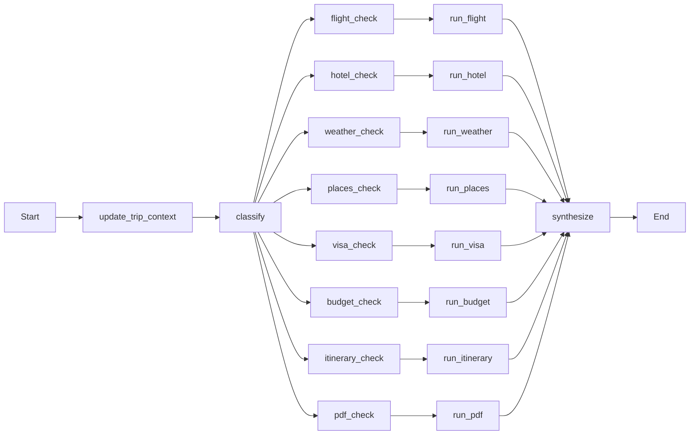

# Travel Concierge AI

An **AI-powered trip planning assistant** built using **LangGraph, FastAPI, and multiple travel APIs**.

It intelligently combines **LLM reasoning with real-world APIs** to generate **complete travel plans including flights, hotels, weather insights, places to visit, budgets, visa information, and downloadable itinerary PDFs**.

---

# Key Features

The system supports **9 AI-powered travel capabilities**.

| Capability | Description |
|---|---|
| Trip Context | Extracts structured travel details from conversation |
| Flight Search | Retrieves real flight options using Amadeus API |
| Hotel Search | Finds hotels in destination cities |
| Weather Forecast | Retrieves forecast for travel dates |
| Places Discovery | Finds attractions using Google Places |
| Budget Estimation | Calculates travel budget estimates |
| Itinerary Planning | Generates a day-wise itinerary |
| Visa Information | Provides informational visa guidance |
| PDF Export | Generates downloadable itinerary PDF |

---

# Architecture Overview

The system uses **LangGraph** to orchestrate AI agents.

The workflow combines:

1. **LLM reasoning**
2. **API tool calls**
3. **specialist agents**
4. **final synthesis**

---

# High Level Architecture



---

# LangGraph Workflow



---

# Project Structure

```
travel-concierge
│
├── api.py
├── workflow.py
├── requirements.txt
├── render.yaml
│
├── agents
│   ├── flight_agent.py
│   ├── hotel_agent.py
│   ├── weather_agent.py
│   ├── places_agent.py
│   ├── budget_agent.py
│   ├── itinerary_agent.py
│   ├── visa_agent.py
│   └── pdf_agent.py
│
├── memory
│   └── trip_context.py
│
├── routing
│   └── router.py
│
├── tools
│   ├── amadeus_tools.py
│   ├── weather_tools.py
│   ├── places_tools.py
│   ├── visa_tools.py
│   └── fx_tools.py
│
├── services
│   ├── amadeus_client.py
│   ├── google_places_client.py
│   ├── open_meteo_client.py
│   └── pdf_service.py
│
├── states
│   └── graph_state.py
│
├── core
│   ├── llm.py
│   ├── prompts.py
│   └── utils.py
│
├── templates
│   ├── index.html
│   └── itinerary_pdf.html
│
└── static
    ├── styles.css
    └── app.js
```

---

# Installation

### Clone repository

```bash
git clone https://github.com/yourrepo/travel-concierge
cd travel-concierge
```

### Install dependencies

```bash
pip install -r requirements.txt
```

Install Playwright browser:

```bash
python -m playwright install chromium
```

---

# Environment Variables

Create `.env`

```
OPENAI_API_KEY=

MONGODB_URI=
MONGODB_DB=travel_concierge

AMADEUS_CLIENT_ID=
AMADEUS_CLIENT_SECRET=

GOOGLE_PLACES_API_KEY=

APP_BASE_URL=http://localhost:8000
DEFAULT_HOME_CURRENCY=INR
```

---

# Running the Server

```bash
uvicorn api:app --reload
```

Server runs on:

```
http://localhost:8000
```

---

# API Endpoints

## Health Check

```
GET /api/health
```

Response

```
{
 "status": "ok"
}
```

---

## Ask Travel Question

```
POST /api/ask
```

Body

```
{
 "query": "Plan a 5 day Thailand trip from Bangalore",
 "session_id": "optional"
}
```

Response

```
{
 "final_answer": "...",
 "agents_used": ["Flight Agent","Hotel Agent"],
 "pdf_url": "/downloads/itinerary_abc.pdf"
}
```

---

# Session Memory

Conversations are persisted in **MongoDB Atlas** using LangGraph checkpointers.

Benefits:

- multi-turn context
- session awareness
- scalable persistence

---

# Deployment

The application is designed to deploy easily on **Render**.

Deploy steps:

1. Connect GitHub repo
2. Add environment variables
3. Deploy

---

# Future Improvements

Possible enhancements:

- multi-city trip planning
- cheaper date flight search
- restaurant booking
- Google Maps route optimization
- price alerts
- airline seat class comparison
- visa API integration
- travel insurance suggestions

---

# Tech Stack

| Component | Technology |
|---|---|
Backend | FastAPI |
AI Orchestration | LangGraph |
LLM | OpenAI GPT |
Flights | Amadeus |
Hotels | Amadeus |
Weather | Open-Meteo |
Places | Google Places |
PDF | Playwright |
Database | MongoDB Atlas |

---

# License

MIT License
