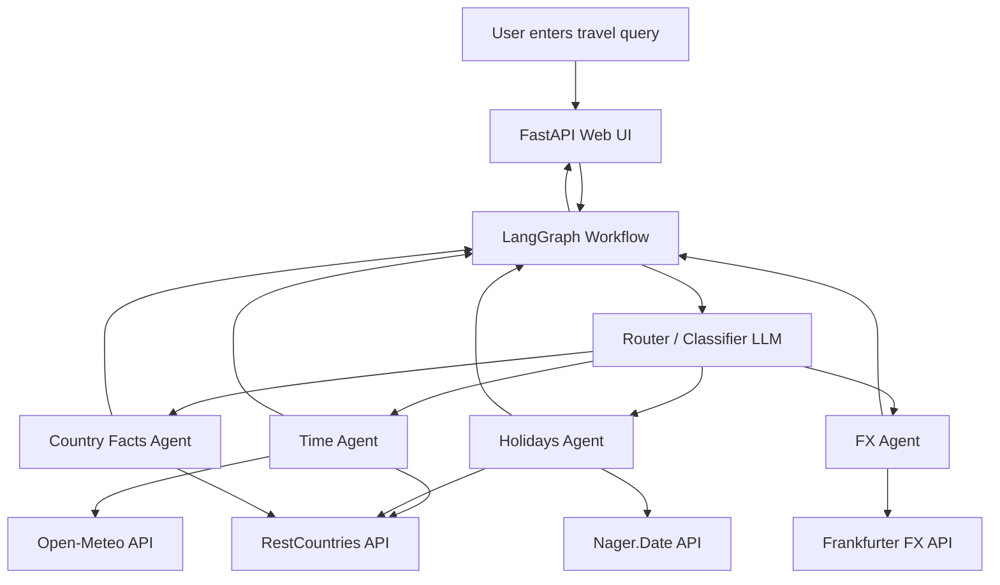

# Travel Concierge — Multi-Agent AI Demo

A multi-agent Travel Concierge built using LangGraph, LangChain, and FastAPI.

This project demonstrates how multiple specialized agents can be orchestrated to answer a single real-world travel query by calling live public APIs instead of relying on model hallucinations.

The application is exposed here: https://travel-concierge-tgsb.onrender.com/

---

## What Does This Application Do?

Given a single user question such as:

"I'm traveling to Japan next week — what time is it there right now, are there any upcoming public holidays, what's the exchange rate from INR to JPY, and can you share some basic facts about Japan?"

The system:

- Breaks the query into multiple intents
- Routes each intent to a dedicated agent
- Forces agents to call real external APIs
- Aggregates responses into a final answer
- Displays both the final answer and individual agent outputs in the UI

---

## Architecture Overview

This system uses a router-based multi-agent architecture powered by LangGraph.

- A router LLM classifies user intent
- Each intent is handled by a specialized agent
- Agents are forced to use tools (no hallucination)
- Results are aggregated and synthesized



---

## Agents and Responsibilities

### Time Agent

- Looks up the destination country
- Extracts capital latitude and longitude
- Fetches real local time and timezone
- Tool usage is mandatory

### Holidays Agent

- Resolves country code
- Fetches upcoming public holidays
- Filters results within a configurable window

### FX Agent

- Extracts source and target currencies
- Fetches real-time exchange rates
- Returns formatted FX data

### Country Facts Agent

- Fetches authoritative country metadata
- Capital, currency, geography, timezones
- No hallucinated facts

---

## Tools and Data Sources

All tools use free, public APIs with minimal sanitization.

### Country Information
- API: https://restcountries.com
- Used for country metadata and capital coordinates

### Local Time and Timezone
- API: https://open-meteo.com
- Used for IANA timezone and local datetime

### Public Holidays
- API: https://date.nager.at
- Used for official national holidays

### Exchange Rates
- API: https://www.frankfurter.dev
- Used for real-time FX rates

---

## Project Structure

```text
Travel-Concierge/
├── api.py # FastAPI app
├── workflow.py # LangGraph workflow
├── routing.py # Router and graph nodes
├── agents.py # Agent definitions
├── tool.py # External API tools
├── templates/
│ └── index.html
├── static/
│ ├── style.css
│ └── app.js
├── architecture.md
├── requirements.txt
└── README.md
```

---

## Running Locally

- Install dependencies:

```bash
pip install -r requirements.txt
```

- Set your API key:

```bash
export OPENAI_API_KEY=sk-xxxx
```

- Start the Server:

```bash
uvicorn api:app --host 0.0.0.0 --port 8000 --reload
```

- Open:

```
http://localhost:8000
```

## Exposing with ngrok

```
ngrok http 8000 --domain <your-static-domain>
```

## Tech Stack

- Python 3.11+

- LangGraph

- LangChain

- FastAPI

- OpenAI GPT-4o-mini

- Open-Meteo

- RestCountries

- Nager.Date

- Frankfurter FX

- ngrok

## License

MIT License


---
